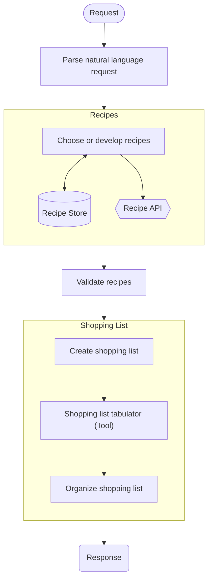

# Meal Planning Assistant
#### An AI project for the MSSE program, completed by Phil Jorgensen
#### [Link to Github](https://github.com/pjorgen/aiml-meal-plan-assistant)

## Problem Statement
Meal planning can be difficult, especially when you try to find recipes for ingredients you have on hand or are trying
to eat more nutritional and balanced foods, but don't have a lot of time or knowledge to spend on creating the perfect 
meal or set of meals.

This tool aims to solve that problem by incorporating user preferences and dietary restrictions and targets to craft the
desired number of meals for the required number of people, all while ensuring balanced nutrition and using ingredients
already on hand as much as possible.

The result given back is a set of recipes that include ingredients, preparation instructions, nutritional information, 
and a shopping list of ingredients.

## Process Planning
The request from the user comes in and undergoes a series of transformations and enhancements to return the meal plan
requested. The process is outlined generally here.

### Request Processing Flowchart


### Request Format
The request is a natural language request, such as
```
Plan five meals for my partner and I, and one meal for a party of 8. 
My partner is a vegetarian, and I am trying to reduce my cholesterol. 
We have basmati rice and diced tomatoes on hand.
It's been a while since we tried cooking chinese food and would like to try it again.
```

### Request Parsing
The request needs to be parsed to find some or all of the following information:
- Number of meals
- Number of people for each meal
- Dietary restrictions for each meal
- Nutritional targets or restrictions for each meal
- Available ingredients
- Cuisine likes and dislikes
- Ingredient likes and dislikes

### Recipe development
We will use the [Spoonacular API](https://spoonacular.com/food-api/docs) for recipe development. While Spoonacular has existing functionality for meal planning,
for the purposes of this project we will limit our API usage to the Recipe endpoints to make the project more interesting
and to limit the depth of integration to Spoonacular.

Note that we registered to use the Spoonacular API with an educational license, which also required setting up a Rapid
API account.

### Validation
We need a layer to ensure the recipes returned adhere to the restrictions and criteria given as inputs. While Spoonacular
does some validation themselves, we want to make sure that between the remote recipes and the ones retrieved from the 
cache that we are consistently in compliance. We will check:
- Ingredients for adherence to diet, allergen restrictions, and likes and dislikes
- Nutrition for adherence to diet and nutrition targets and restrictions
- Recipe for cuisine likes and dislikes
- Recipe for proper scaling to number of people
- Correct number of recipes

### Shopping List
Generation of the shopping list for the meal plan will be done via external tool to tabulate the food items and quantity
needed. A further pass through an LLM will be made to organize the shopping list into categories for efficient shopping.

### User Interface
A simple user interface will be created that provides a Chat GPT-like experience for entering a natural lanugage prompt
and receiving a streamed response from the system.

### Implementation
The project will be implemented in Python and make use of the following tools:
- Ollama model for local processing of prompts
- DSPy for orchestration and evaluation
- Streamlit for IO and UI
- Weaviate as a vector database

### Deployment
The application will be deployed to Docker containers, and part of the project will be to develop the deployment scripts
and packages to fully implement the application.

## Development and Implementation Log

### Environment setup
Base environment for development includes:
- Docker Desktop for Windows
- WSL running Ubuntu
- PyCharm

#### Ollama
I set up ollama on Ubuntu via WSL. This included:
- [Installing ollama on linux](https://ollama.com/download/linux)
- [Installing the nvidia toolkit to enable GPU acceleration](https://docs.nvidia.com/datacenter/cloud-native/container-toolkit/latest/install-guide.html) 
- [Run ollama as a docker container](https://ollama.com/blog/ollama-is-now-available-as-an-official-docker-image)
- Command to run the docker container (Ubuntu): `docker run -d --gpus=all -v ollama:/root/.ollama -p 11434:11434 --name ollama ollama/ollama`
- I chose [Gemma3](https://ollama.com/library/gemma3) as a starting model, using the smallest 1b variant
- Command to start an ollama model (Ubuntu): `docker exec -it ollama ollama run gemma3:1b`

#### Anaconda dev environment
I used PyCharm as an IDE with Anaconda as the Python interpreter
- [Install Anaconda](https://www.anaconda.com/docs/getting-started/anaconda/install#windows-installation)
- Connect Anaconda to Powershell
- Create `conda_env.yml` with starting dependencies including python, pydantic, and dspy
- Run `conda env create -f conda_env.yml` and then `conda activate meal-plan`


### Development

#### Day 1

I started with a simple script, `ollama_test.py` to test connecting to the running docker container. This was successful!

Next, I tried a simple DSPy setup to ensure it was able to connect. Unfortunately, I ran into an issue where the `litellm`
module used by DSPy [had a regression](https://github.com/BerriAI/litellm/issues/10272) where it was using the wrong encoding to read files, causing an error immediately on
import. The workaround was to set the python environment to explicitly use UTF-8: `$env:PYTHONUTF8="1"`

Once I had that figured out, I was able to create `dspy_test.py`, a simple script using dspy to interact with the model.
I used this script to verify the settings were correct for connecting to the ollama container.

From there, I was able to begin building the first DSPy module for extracting a variety of information from the user's 
initial prompt. Given a text input, the module extracts the number of meals to plan, the number of people for each meal, 
liked and disliked cuisines and foods, as well as desired nutritional targets and dietary restrictions.
I wrapped this in a custom DSPy signature and module, and then began looking to optimize the module.

Optimization took quite a while to figure out the syntax and flow needed. I had a lot of trouble at first with passing the
right arguments to each portion of the process. At first I hand-made a set of test Examples, but quickly realized that 
three would be far too few. Instead, I turned to ChatGPT to help me produce a set of 60 test Examples and another 10 Dev
Examples using my custom signature. This worked really well, though I admit to not thoroughly analyzing the results 
beyond a few spot checks. 

From there I split the script into several pieces to compartmentalize the code. There's a short script, `lm.py` that 
defines the connection to the ollama model. There's the DSPy module signature and model definition in `extract_info.py`.
`dspy_data.py` is the test data for the module, and `dspy_extract_optimize.py` is the code that optimizes the module 
against the test data and saves the optimized module to file for reuse (saved to `optimized\extract_optimized.json`).

#### Day 2

I realized while thinking about the project away from my desk that I may be approaching the DSPy optimization and pipeline
in a naive manner. By attempting to extract all information in a single LLM call, DSPy and the LLM are unable to speccialize
as much as they could otherwise, leading to the low scores seen even after optimization. Further, the information extraction
may be too vague or general, and it would perhaps be better to frame the problem as a series of classifications based on
known classes and values. However, this is currently a lower priority and will be revisited if time permits. 

Today's goal is to get started with the Spoonacular API and get it set up. I started by setting up an account to get an
API key. Spoonacular advertised that they have SDKs for using their API, which includes a python SDK. I spent nearly two
hours trying to get their SDK to work, only to run into several issues. First, I couldn't clone the repository from Git,
as I kept getting a "repository does not exist" error. Once I found a link to download a zip file, I was finally able to
build and import the module into my project. However, as soon as I tried to run any code that imported the module, I was
met with a bunch of errors. Turns out that their SDKs are automatically generated, and there doesn't appear to be very 
much quality control. 

So I was back to square one, and started to figure out how to use the python requests library to 
make calls to the API instead. Even here, the Spoonacular API documentation is woefully inadequate, and does not lay out
their authentication methods very well. I ended up asking ChatGPT to write a sample script for me, and it was able to 
provide an example that ran first try once I inserted my API key.

From there, I started building out the structure of the requests and responses to use with Spoonacular. I created some 
enums to use for common values, classes for the request and extended response, and a script to provide the API interaction.
The next step was revisit the DSPy portion to better match the Spoonacular structure.

Updating the DSPy signatures and module took a while, but it is likely a lot better. I did end up splitting the
extraction of each piece of data into a separate operation to help the model be as specific and performant as possible.
This meant writing close to 300 lines of code. This includes a set of data validation/best matching code to take the 
outputs from the model and translate it into a format that will be acceptable to the pydantic model. This is now working
smoothly. The next step is to integrate the data extraction and API call together. It worked pretty well right off the bat,
with an issue with my pydantic models that capture the response not being set up correctly. However, I have run out of time
tonight and will fix that tomorrow. It's good to see that I have the initial pipeline from natural language prompt to API 
call and response working so far!

With the updates to the DSPy code, I also need to revisit the optimization training data and method, which is now back on
the to-do list. Having the existing experience with it from yesterday will help, but having to create all-new training data
may be a pain, especially since the structure has become more complex and specific.

#### Day 3

Goals for today are to 1) put a front end UI on the project and 2) pipe in the input prompt and pipe out the prompt 
summary and recipes to the output in user-friendly formats. If there is time left, looking again at caching or optimization
would be the next steps.

I started with templating out a UI using Streamlit. Installing the package was easy, which was a nice change after trying
to install the spoonacular library. It was actually pretty easy to get started with streamlit, and I was able to redevelop
my `app.py` program to take an input prompt, process it, and output each piece in steps while notifying the user that 
processing is happening. I was also able to add a couple of buttons as quick-links to demo prompts, which was neat.

During testing of the UI, I also ended up fixing a few issues with the spoonacular API and class definitions. Apparently 
the Spoonacular API documentation also lied about what some of the values for diets are, and some of the return values 
were not marked as Optional in my classes and resulting in thrown validation errors. These were pretty easy to fix.

The next issue I ran into was that my dspy information extraction was being quite annoying when creating the list of
ingredients to include. The model kept returning ingredients it thought were useful instead of ones specifically mentioned,
which caused the Spoonacular API to return no matching recipes. I ended up tweaking the signatures to explicitly define
the string literals expected for the cuisines, diet, and intolerances. This was a bit of a pain since python Literal[] 
does not support dynamic value setting, so I couldn't unpack the existing enums into a literal easily. I ended up having
ChatGPT do the unpacking for me.

Once I figured out the issues introduced by the rework, I started running the optimization again and quickly found
more failures. Additionally, running the optimizer often threw a few weird errors that looked like bad output from the LLM.
Because I had started with the smallest 1B version of gemma3, I figured that it could be an issue with the model not being
smart enough for what I needed, and I took the opportunity to upgrade to the 4B version of gemma3 instead. Now running 
the optimization is much more stable, though I'm still waiting on results since it takes about an hour to run still. 
Depending on the results I may decide to run the optimizer again with higher settings, but we'll see.

#### Day 4

Today I began final tweaks. I let the optimizer run overnight, since it now takes close to 5 hours to complete. The results
were... less than satisfactory, and indicated hardly any increase in score based on my custom metric function. Indeed, 
in testing the demo it still performs poorly and tends to hallucinate pretty badly. I took several steps to increase the 
performance and accuracy. First, I upgraded to the ollama model gemma3:12b, in hopes that additional parameters will 
perform better. Thankfully my laptop has enough RAM to run it, since the model requires 8.1 GB for the 12b model. The
second big change I made was to do additional prompt engineering in the DSPy signatures via the docstring to enhance the
responses. Initial tests even with an unoptimized model were promising, resulting in marked improvement. 

I did attempt to change the optimizer I was using from BootstrapFewShot to MIPROv2, but was unable to get it working in 
the time given. Further, I think the limited training set was a hindrance in my optimization and training efforts, as 
having only 20 examples greatly limited DSPy's ability to iterate and mutate prompt strategies. Future work would include
developing a more comprehensive training set. Even 200 examples would go a long way to being better training data. 

I spent a fair amount of time tweaking the program and trying to run various queries. I found that it was fairly unstable,
and ended up removing some of the strong typing. The DSPy signatures were sometimes throwing errors when trying to return 
values that were filtered by literal values, and even the API I'm using was causing issues by sending unspecified values
for certain parameters. By loosening the expected values a bit, I was able to avoid more of the issues.

However, the issue with the LLM calls remains where it sometimes picks out extra cuisines, ingredients, diets, and other
information that isn't indicated by the prompt. There's also a strange issue where sometimes it looks like it should be
requesting or searching for multiple recipes, but only returns one.


## Future Development
There is limited time and effort available to complete this project at this time, which leaves several features for future
consideration. These are parked here for reference.
- Local vector database for storing and caching recipes (Side project: digitize and store recipes from recipe books here)
- Static site for viewing, referencing, and rating recipes in the cache
- Inventory management system for automatic integration into recipes, including auto-updating inventory after meal planning
- Multi-user support for saving preferences, dietary restrictions, and nutritional targets

## Time log
- Initial plan: 4 hours
- Dev day 1 (initial dspy module and optimization): 8 hours
- Dev day 2 (additional dspy and api setup): 8 hours
- Dev day 3 (Adding StreamLit UI and reworking dspy): 9 hours
- Dev day 4 (Final DSPy rework and containerization): 6 hours