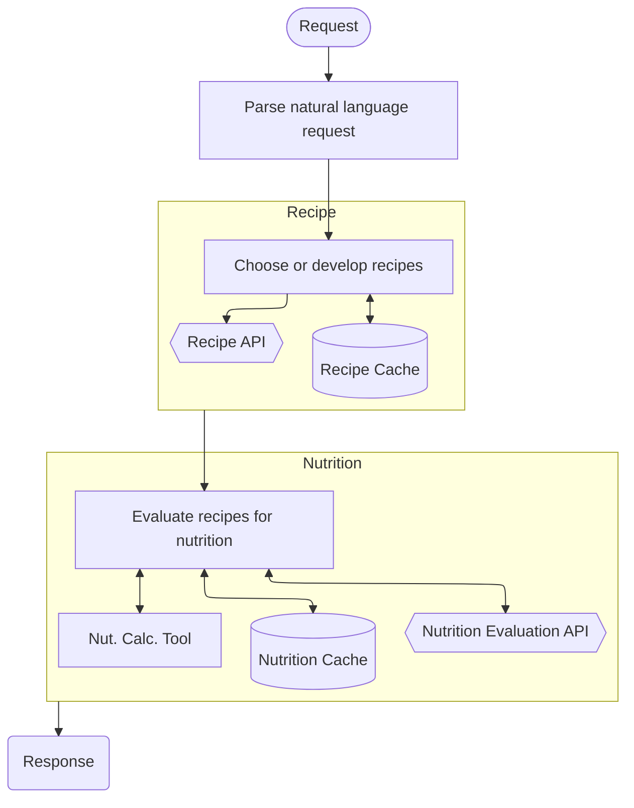

# Meal Planning Assistant
#### An AI project for the MSSE program, completed by Phil Jorgensen

## Problem Statement
Meal planning can be difficult, especially when you try to find recipes for ingredients you have on hand or are trying
to eat more nutritional and balanced foods, but don't have a lot of time or knowledge to spend on creating the perfect 
meal or set of meals.

This tool aims to solve that problem by incorporating user preferences and dietary restrictions and targets to craft the
desired number of meals for the required number of people, all while ensuring balanced nutrition and using ingredients
already on hand as much as possible.

The result given back is a set of recipes that include ingredients, preparation instructions, nutritional information, 
and a shopping list of ingredients.

## Process
The request from the user comes in and undergoes a series of transformations and enhancements to return the meal plan
requested. The process is outlined generally here.

### Request Processing Flowchart


### Request Format
The request is a natural language request, such as
```
Plan five meals for my partner and I, and one meal for a party of 8. 
My partner is a vegetarian, and I am trying to reduce my cholesterol. 
We have basmati rice and diced tomatoes on hand.
```

### Request Parsing
The request needs to be parsed to find the following information:
- Number of meals
- Number of people for each meal
- Dietary restrictions for each meal
- Nutritional targets or restrictions for each meal
- Available ingredients

### Recipe development
We will use the "How to Cook" MCP tool to interact with the "How to Cook" API for recipe development. 